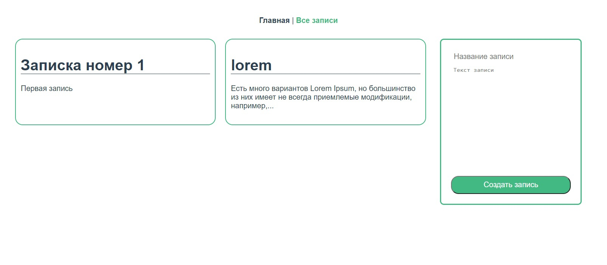
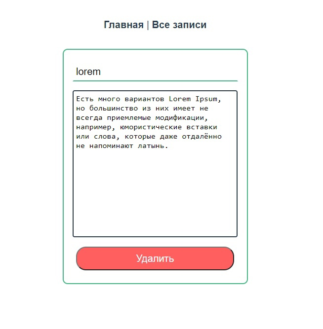

# Задание:

Написать веб-приложение "Записная книжка".
Приложение должно состоять из 2 частей:

1. Rest Api сервер на Node.js с использованием TypeScript.
   Api должен обрабатывать следующие запросы:
- Просмотр всех записей
- Получение записи по id
- Создание новой записи
- Изменение записи
- Удаление записи
  Записи должны храниться в MongoDB (можно использовать Atlas).
  В качестве ODM использовать mongoose.

2. Веб-сайт на Vue.js с использование TypeScript, взаимодействующий с Api.
   На сайте должны быть следующие возможности:
- Просмотр всех записей
- Получение записи по id
- Создание новой записи
- Изменение записи
- Удаление записи


# Установка проекта:

* ###Создать папку
* ```git clone https://github.com/IncomprehensibleGuy/it-ontime-task .```
* ###Зайти в /api
* В /api создать файл ".env.local" и внести следующие константы (БД открыта):
```
PORT=3000
DB_USER=admin
DB_PASSWORD=admin
```
* ```npm install```
* ```npm run dev```
* ###Зайти в /client
* ```npm install```
* ```npm run serve```
Клиент должен запуститься на порту 8080.

# Как выглядит:

Для обновление записи достаточно изменить заголовок и текст в input и textarea, данные обновятся автоматически

